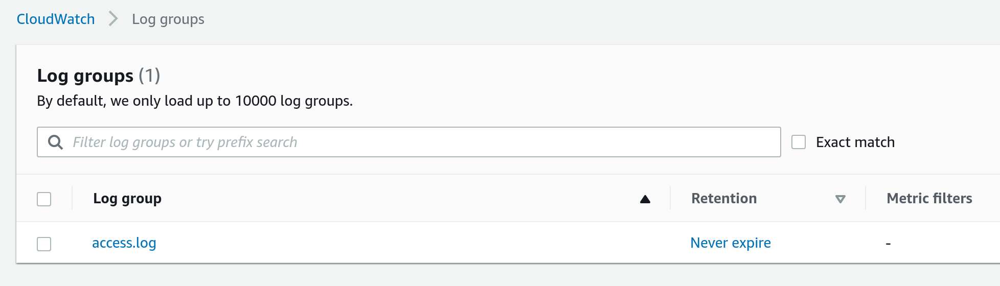

# Use Terraform to create a webserver on AWS with logs sent to Cloudwatch

Creates everything from a VPC, subnets, route tables all the way up to an EC2 instance, with Apache webserver logs sent to Cloudwatch



### Cost estimate

Powered by Infracost.

```
Project: gordonmurray/terraform_aws_ec2_cloudwatch_logs/.

 Name                                                       Monthly Qty  Unit                    Monthly Cost

 aws_cloudwatch_log_group.webserver_logs
 ├─ Data ingested                                     Monthly cost depends on usage: $0.57 per GB
 ├─ Archival Storage                                  Monthly cost depends on usage: $0.03 per GB
 └─ Insights queries data scanned                     Monthly cost depends on usage: $0.0057 per GB

 aws_instance.example
 ├─ Instance usage (Linux/UNIX, on-demand, t3.micro)                730  hours                          $8.32
 └─ root_block_device
    └─ Storage (general purpose SSD, gp2)                            10  GB                             $1.10

 aws_kinesis_firehose_delivery_stream.webserver
 ├─ Data ingested (first 500TB)                       Monthly cost depends on usage: $0.031 per GB
 └─ Format conversion                                 Monthly cost depends on usage: $0.019 per GB

 aws_s3_bucket.cloudwatch_logs_bucket
 ├─ Standard
 │  ├─ Storage                                        Monthly cost depends on usage: $0.023 per GB
 │  ├─ PUT, COPY, POST, LIST requests                 Monthly cost depends on usage: $0.005 per 1k requests
 │  ├─ GET, SELECT, and all other requests            Monthly cost depends on usage: $0.0004 per 1k requests
 │  ├─ Select data scanned                            Monthly cost depends on usage: $0.002 per GB
 │  └─ Select data returned                           Monthly cost depends on usage: $0.0007 per GB
 ├─ Standard - infrequent access
 │  ├─ Storage                                        Monthly cost depends on usage: $0.0125 per GB
 │  ├─ PUT, COPY, POST, LIST requests                 Monthly cost depends on usage: $0.01 per 1k requests
 │  ├─ GET, SELECT, and all other requests            Monthly cost depends on usage: $0.001 per 1k requests
 │  ├─ Lifecycle transition                           Monthly cost depends on usage: $0.00 per 1k requests
 │  ├─ Retrievals                                     Monthly cost depends on usage: $0.01 per GB
 │  ├─ Select data scanned                            Monthly cost depends on usage: $0.002 per GB
 │  └─ Select data returned                           Monthly cost depends on usage: $0.01 per GB
 └─ Glacier flexible retrieval
    ├─ Storage                                        Monthly cost depends on usage: $0.0036 per GB
    ├─ PUT, COPY, POST, LIST requests                 Monthly cost depends on usage: $0.033 per 1k requests
    ├─ GET, SELECT, and all other requests            Monthly cost depends on usage: $0.0004 per 1k requests
    ├─ Lifecycle transition                           Monthly cost depends on usage: $0.00 per 1k requests
    ├─ Retrieval requests (standard)                  Monthly cost depends on usage: $0.033 per 1k requests
    ├─ Retrievals (standard)                          Monthly cost depends on usage: $0.01 per GB
    ├─ Select data scanned (standard)                 Monthly cost depends on usage: $0.0084 per GB
    ├─ Select data returned (standard)                Monthly cost depends on usage: $0.01 per GB
    ├─ Retrieval requests (expedited)                 Monthly cost depends on usage: $11.00 per 1k requests
    ├─ Retrievals (expedited)                         Monthly cost depends on usage: $0.03 per GB
    ├─ Select data scanned (expedited)                Monthly cost depends on usage: $0.021 per GB
    ├─ Select data returned (expedited)               Monthly cost depends on usage: $0.03 per GB
    ├─ Select data scanned (bulk)                     Monthly cost depends on usage: $0.001 per GB
    ├─ Select data returned (bulk)                    Monthly cost depends on usage: $0.0025 per GB
    └─ Early delete (within 90 days)                  Monthly cost depends on usage: $0.0036 per GB

 OVERALL TOTAL                                                                                          $9.42
──────────────────────────────────
26 cloud resources were detected:
∙ 4 were estimated, all of which include usage-based costs, see https://infracost.io/usage-file
∙ 22 were free, rerun with --show-skipped to see details
```